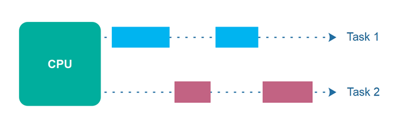
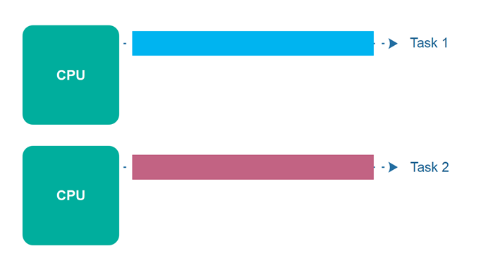
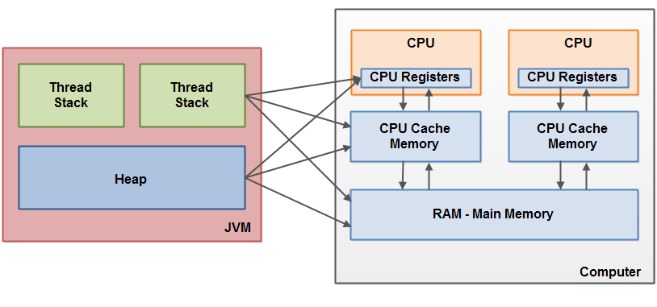
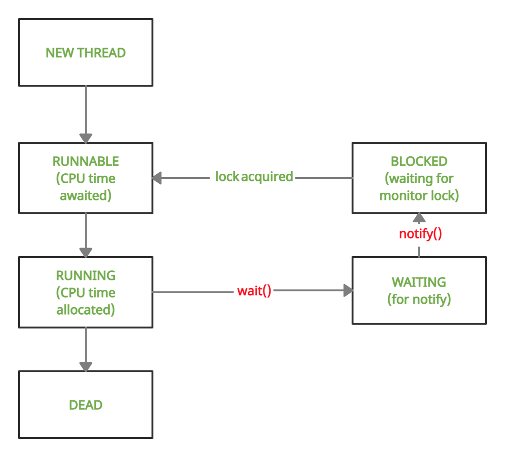
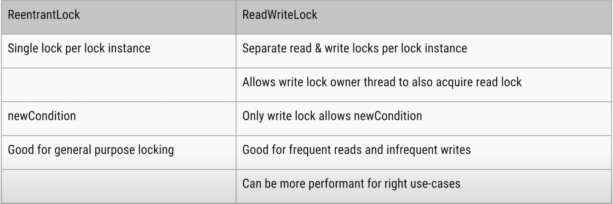

# Deep dive into java
## JVM
### ClassLoader
The Java ClassLoader is a part of the Java Runtime Environment that dynamically loads Java classes into the Java Virtual Machine. Java classes aren’t loaded into memory all at once, but when required by an application. 

<details>
  <summary>Types of ClassLoaders</summary>
  <br/>
  
  + **BootStrap ClassLoader:**  is a Machine code which kickstarts the operation when the JVM calls it. It is not a java class.
  + **Extension ClassLoader:** is a child of **Bootstrap ClassLoader** and loads the extensions of core java classes from JDK (jre/lib/ext)
  + **System Class Loader:** takes care of loading all the application level classes into the JVM
  
  Ref: https://www.geeksforgeeks.org/classloader-in-java/#:~:text=The%20Java%20ClassLoader%20is%20a,when%20required%20by%20an%20application.

</details>

## Memory
### Memory Allocation

<details>
  <summary>Object type vs primitive data type</summary>
  <br/>
  
   Type name | Object type | Primitive data type | 
   | --- | --- | --- | 
  Interger vs int | 16 bytes | 4 bytes 
  Short vs short | 0 | 2 bytes
  Byte vs byte | 0 | 1 byte
  Float vs float | 0 | 4 bytes
  Double vs double | 0 | 8 bytes
  Long vs long | 24 bytes | 8 bytes
  Boolean vs boolean | 0 | 1 bit
  char | - | 2 bytes
  String | 40 bytes | -
  
  + Ref: https://www.javamex.com/tutorials/memory/

</details>
<details>
  <summary>Memory configuration</summary>
  <br/>
  
   | Type name | Description | 
   | --- | --- | 
   | -Xms | set initial Java heap size
   | -Xmx | set maximum Java heap size
  
  + Ref: https://alvinalexander.com/blog/post/java/java-xmx-xms-memory-heap-size-control/

</details>

## SOLID

<details>
  <summary>Single responsibility principle</summary>
  <br/>
  
  A class should only have one responsibility
  
  _Example:_ The `EntityManager` interface provides a set of methods to persist, update, remove and read entities from a relational database. It doesn’t implement any business logic or validation or user authentication.
  
</details>
<details>
  <summary>Open for Extension, Closed for Modification principle</summary>
  <br/>
  
  Classes should be open for extension but closed for modification.

  _Example:_
  ```
  public interface PaymentProcessor {
      void processPayment(Order order);
  }
  
  public class PayPalPaymentProcessor implements PaymentProcessor {
      // Implementation for PayPal
  }
  
  public class CreditCardPaymentProcessor implements PaymentProcessor {
      // Implementation for credit card
  }
  ```
  By using an interface `PaymentProcessor`, we can introduce new payment methods without modifying the `Order` class.
</details>
<details>
  <summary>Liskov Substitution principle</summary>
  <br/>
  
  If class A is a subtype of class B, we should be able to replace B with A without disrupting the behavior of our program.
  
  Signs of violation of the substitutions Liskov:
  + Overridden methods with unexpected behavior
  + Empty method overrides

  Example: a `Square` class inherits from `Rectangle`, but always enforces `width` to equal `height`. This breaks the expectation of independent width and height manipulation in rectangles.
  
</details>
<details>
  <summary>Interface segregation principle</summary>
  <br/>
  
  Larger interfaces should be split into smaller ones to fit with multiple specific purposes.
  
  _Example:_ If only data manipulation (CRUD) is needed, we can use `CrudRepository`. And when we need to view pages, we can use `PagingAndSortingRepository`
  
</details>
<details>
  <summary>Dependency Inversion principle</summary>
  <br/> 
  
  + High-level modules should not depend on low-level modules. Both should depend on abstractions.
  + Abstractions should not depend on details. Details should depend on abstractions.
  
  _Example:_ 
  
  ```
  public interface Keyboard { }
  ```
  
  ```
  public class Windows98Machine{

      private final Keyboard keyboard;

      public Windows98Machine(Keyboard keyboard) {
          this.keyboard = keyboard;
      }
  }
  ```
  
  _`Windows98Machine` depends on  `Keyboard`_
  

  
</details>

## Concurrency
### Concurrency vs Parallelism

<details>
  <summary>Concurrency</summary>
  <br/>
  
  
  
  Concurrency means that an application is making progress on more than one task - at the same time or at least seemingly at the same time. If the computer only has one CPU the application may not make progress on more than one task at _exactly the same time_
  
</details>

<details>
  <summary>Parallel</summary>
  <br/>
  
  
  
  Parallel execution is when a computer has more than one CPU or CPU core, and makes progress on more than one task simultaneously.
  
</details>

<details>
  <summary>Parallel Concurrency</summary>
  <br/>
  
  
  
</details>

### Race condition
`Race conditions` occur only if multiple threads are accessing the same resource, and one or more of the threads write to the resource. If multiple threads read the same resource `race conditions` do not occur.

Two types of `race condition`:
+ <details>
  <summary>Read-modify-write</summary>
  
  ```
  public class Counter {
       protected long count = 0;

       public void add(long value){
           this.count = this.count + value;
       }
  }
  ```
  For example, two threads wanted to add values 2 and 3. Thus the result should be 5 after the two threads complete execution. In the above case it is 2, but it could as well have been 3.
</details>

+ <details>
  <summary>Check-then-act</summary>
  
  ```
  public class CheckThenActExample {

      public void checkThenAct(Map<String, String> sharedMap) {
          if(sharedMap.containsKey("key")){
              String val = sharedMap.remove("key");
              if(val == null) {
                  System.out.println("Value for 'key' was null");
              }
          } else {
              sharedMap.put("key", "value");
          }
      }
  }
  ```
</details>
  
### Java memory model
<details>
  <summary>Bridging The Gap Between The Java Memory Model And The Hardware Memory Architecture</summary>

  
  
</details>

### Thread Signaling
  
<details>
  <summary>Overview</summary>

  
  
</details>

<details>
  <summary>wait(), notify() and notifyAll()</summary>

  + **wait()**<br/>
  
    It tells the calling thread to give up the lock and go to sleep until some other thread enters the same monitor and calls notify().
  
  + **notify()**<br/>
  
    It wakes up one single thread that called wait() on the same object. It should be noted that calling notify() does not actually give up a lock on a resource. It tells a waiting thread that that thread can wake up.
  
  + **notifyAll()**<br/>
  
    It wakes up all the threads that called wait() on the same object.
  <br/>
  _main_

  ```
  public class Hello {
      public static void main(String[] args) {
        Queue < String > q = new LinkedList < > ();
        boolean exit = false;
        Producer p = new Producer(q, exit);
        p.start();
        Consumer c = new Consumer(q, exit);
        c.start();
      }
  }
  ```


  _producer_
  ```
  public class Producer extends Thread {

      private volatile Queue < String > sharedQueue;

      private volatile boolean bExit;

      public Producer(Queue < String > myQueue, boolean bExit) {
          this.sharedQueue = myQueue;
          this.bExit = bExit;
      }
      public void run() {
          while (!bExit) {
              synchronized(sharedQueue) {
                  while (sharedQueue.isEmpty()) {
                    String item = String.valueOf(System.nanoTime());
                    sharedQueue.add(item);
                    System.out.println("Producer added : " + item);
                      try {
                          System.out.println("Producer sleeping by calling wait: " + item);
                          sharedQueue.wait();
                          System.out.println("Producer wake up: ");
                      } catch (InterruptedException e) {
                          e.printStackTrace();
                      }
                  }
              }
          }
      }
  }
  ```

  _consumer_

  ```
  public class Consumer extends Thread {

      private volatile Queue < String > sharedQueue;

      private volatile boolean bExit;

      public Consumer(Queue < String > myQueue, boolean bExit) {
          this.sharedQueue = myQueue;
          this.bExit = bExit;
      }
      public void run() {
          while (!bExit) {
              synchronized(sharedQueue) {
                  while (!sharedQueue.isEmpty()) {
                      String item = sharedQueue.poll();
                      System.out.println("Consumer removed : " + item);
                      System.out.println("Consumer notifying Producer: " + item);
                      sharedQueue.notify();
                  }
              }
          }
      }
  }
  ```
  _Output_

  ```
    Producer added : 12275948008616
    Producer sleeping by calling wait: 12275948008616
    Consumer removed : 12275948008616
    Consumer notifying Producer: 12275948008616
    Producer wake up: 
    Producer added : 12275948047960
    Producer sleeping by calling wait: 12275948047960
    Consumer removed : 12275948047960
    Consumer notifying Producer: 12275948047960
  ```

  + Ref: https://www.java67.com/2019/05/when-and-how-to-use-wait-and-notify-in-Java.html
  + Ref: https://ducmanhphan.github.io/2019-12-07-Using-wait-notify-in-synchronized-method-block-of-Multithreading-Java/
  + Ref: https://howtodoinjava.com/java/multi-threading/wait-notify-and-notifyall-methods/
  </details>

### Java monitor
<details>
  <summary>What is a monitor?</summary>
  <br/>
  
  Simply put, a _**monitor**_ is something that a thread can grab and hold, preventing all other threads from grabbing that same monitor and forcing them to wait until the monitor is released. 
</details>
<details>
  <summary>monitor vs synchronized keyword</summary>
  <br/>
  
  ```
  Object foo = new Object();
  synchronized (foo) {
    System.out.println("Hello world.");
  }
  ```
  The current thread will first grab the monitor associated with the object stored in variable `foo` and hold it while it prints `"Hello world"`, then releases it.
  
</details>
  
### Lock
  
<details>
  <summary>Lock and Synchronized Block</summary>
  <br/>
  
  + _lock()_ & _unlock()_ operation in separate methods
  + Support fairness by specifying the fairness property
  + The Lock API provides _tryLock()_ method. This reduces blocking time of thread waiting for the lock
  + Provides _lockInterruptibly()_ which can be used to interrupt the thread when it's waiting for the lock
  
  Ref: https://www.baeldung.com/java-concurrent-locks
  Ref: https://winterbe.com/posts/2015/04/30/java8-concurrency-tutorial-synchronized-locks-examples/
  
</details>
  
<details>
  <summary>Condition Variable</summary>
  <br/>
  
  Condition variables are instance of java.util.concurrent.locks.Condition class. As a reentrant lock replaces synchronized blocks or methods, a condition replaces the object monitor methods. which provides inter-thread communication methods similar to `wait()`, `notify()` and `notifyAll()` e.g. `await()`, `signal()`, and `signalAll()`.
  
  _Note: The lock can have multiple condition variables associated with the same lock_
  
  + Ref: https://javarevisited.blogspot.com/2015/06/java-lock-and-condition-example-producer-consumer.html#ixzz7QhNth9mS
  + Ref: https://medium.com/@tarunjain07/volatile-reentrant-lock-vs-synchronize-condition-variable-66e870a8434d#2738
  
</details>
<details>
  <summary>Pros & cons</summary>
  <br/>
  
  Pros:
  1) Ability to lock interruptibly.
  2) Ability to timeout while waiting for lock.
  3) Power to create fair lock.
  4) API to get list of waiting thread for lock.
  5) Flexibility to try for lock without blocking.
  
  Cons:
  1) wrapping method body inside `try-finall` block

Read more: https://javarevisited.blogspot.com/2013/03/reentrantlock-example-in-java-synchronized-difference-vs-lock.html#ixzz7QhMEYXjR
  
  Ref: https://javarevisited.blogspot.com/2013/03/reentrantlock-example-in-java-synchronized-difference-vs-lock.html#axzz7Qc6BsHhk
  
</details>
<details>
  <summary>ReadWriteLock vs ReentrantLock</summary>
  <br/>
  
  **ReadWriteLock**:
  + `ReadLock` and `WriteLock` though are 2 separate instances only 1 will be allowed at a time...
  + Either `ReadLock` is being used _**(by n threads)**_ or `WriteLock` is being used _**(by 1 thread)**_
  + But never both at same time
  
  **ReentrantLock**:
  + One thread at a time
  
  
  
  
  Ref: https://www.youtube.com/watch?v=7VqWkc9o7RM&ab_channel=DefogTech
</details>

  
### Semaphores
  A Semaphore in Java is a Thread Synchronization construct that controls access to the shared resource with the help of counters. 
  
<details>
  <summary>Types of semaphores</summary>
  <br/>
  
  + Counting Semaphores
  + Bounded Semaphores
  + Timed Semaphores
  + Timed Semaphores
  
</details>
  
<details>
  <summary>Semaphore vs Mutex</summary>
  <br/>
  
  Semaphore can be counted, while mutex can only count to 1.
  
  _Note: Mutex (synchronized keyword, ReentrantLock, ReadWriteLock, ...)_
  
  Ref: https://www.baeldung.com/java-mutex
</details>
  
## Exception Handling
### Checked exception & Unchecked exception
  
<details>
  <summary>When to choose checked and unchecked exceptions</summary>
  <br/>
  
  Use checked expections for recoverable conditions and runtime exceptions for programming errors
  
  Ref: https://stackoverflow.com/questions/499437/in-java-when-should-i-create-a-checked-exception-and-when-should-it-be-a-runti?noredirect=1&lq=1
  
  Ref: https://stackoverflow.com/questions/27578/when-to-choose-checked-and-unchecked-exceptions
  
</details>
