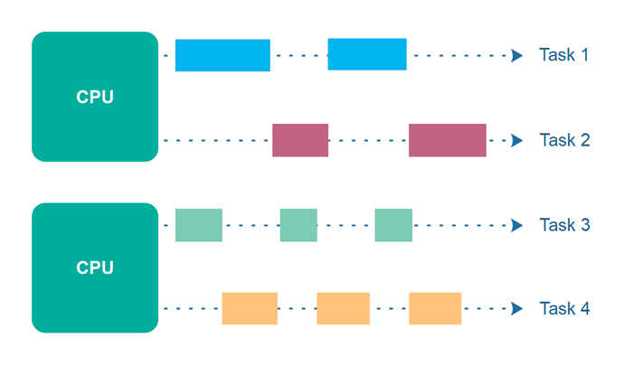

# Deep dive into java
## JVM
### ClassLoader
<details>
  <summary>What is ClassLoader</summary>
  <br/>

  The Java ClassLoader is a part of the Java Runtime Environment that dynamically loads Java classes into the Java Virtual Machine. Java classes aren’t loaded into memory all at once, but when required by an application. 

</details>

<details>
  <summary>Types of ClassLoaders</summary>
  <br/>
  
  + **BootStrap ClassLoader:**  is a Machine code which kickstarts the operation when the JVM calls it. It is not a java class.
  + **Extension ClassLoader:** is a child of **Bootstrap ClassLoader** and loads the extensions of core java classes from JDK (jre/lib/ext)
  + **System Class Loader:** takes care of loading all the application level classes into the JVM
  
  Ref: https://www.geeksforgeeks.org/classloader-in-java/#:~:text=The%20Java%20ClassLoader%20is%20a,when%20required%20by%20an%20application.

</details>

## Memory
### Memory Allocation

<details>
  <summary>Object type vs primitive data type</summary>
  <br/>
  
   Type name | Object type | Primitive data type | 
   | --- | --- | --- | 
  Interger vs int | 16 bytes | 4 bytes 
  Short vs short | 0 | 2 bytes
  Byte vs byte | 0 | 1 byte
  Float vs float | 0 | 4 bytes
  Double vs double | 0 | 8 bytes
  Long vs long | 24 bytes | 8 bytes
  Boolean vs boolean | 0 | 1 bit
  char | - | 2 bytes
  String | 40 bytes | -
  
  + Ref: https://www.javamex.com/tutorials/memory/

</details>
<details>
  <summary>Memory configuration</summary>
  <br/>
  
   | Type name | Description | 
   | --- | --- | 
   | -Xms | set initial Java heap size
   | -Xmx | set maximum Java heap size
  
  + Ref: https://alvinalexander.com/blog/post/java/java-xmx-xms-memory-heap-size-control/

</details>

<details>
  <summary>Byte array vs InputStream in memory usage</summary>
  <br/>

  InputStream is generally better than Byte Array in terms of memory usage. 

  _InputStream:_

  + **Chunked Reading:** InputStream reads data in small chunks, rather than loading the entire file into memory at once. This means only a small portion of the data is in memory at any given time.
  + **Lower Memory Footprint:** Because it processes data incrementally, InputStream uses significantly less memory, making it ideal for large files or high-traffic scenarios.

  _Byte Array:_

  + **Full Data Loading:** Byte Array loads the entire file into memory. For large files, this can consume a lot of memory.
  + **High Memory Usage:** If you have multiple large files or many concurrent requests, the memory usage can quickly add up, potentially leading to memory exhaustion.
  
</details>

<details>
  <summary>Optimize Java applications</summary>
  <br/>
  
  + Efficient Data Structures - For example, use `ArrayList` for accessing rather than insertions/deletions, use `LinkedList` if have frequent insertions/deletions and less frequent access.
  + Optimize I/O Operations - Use BufferedReader and BufferedWriter for reading and writing text files.
  + Optimize SQL Queries
  + Cache Results
  + Use Asynchronous Processing

</details>

### Memory Management

<details>
  <summary>What is garbage collection in Java</summary>
  <br/>
  
</details>

<details>
  <summary>Stack memory and Heap memory</summary>
  <br/>

  **Stack Memory:**
  + Used for static memory allocation and the execution of threads.
  + Stores method calls, local variables, and references to objects in the heap.
  + Managed automatically by the JVM.
  + Stack memory is allocated per thread.

  **Heap Memory:**
  + Used for dynamic memory allocation.
  + Stores all Java objects and JRE classes.
  + Managed by the JVM’s garbage collector.
  + Heap memory is shared among all threads.
  
</details>

<details>
  <summary>StackOverflowError vs OutOfMemoryError</summary>
  <br/>

  `StackOverflowError`
  + Cause: This error occurs when the _stack memory_ allocated for a Java application is exhausted.
  + Example: A recursive method without a base case

  ```
  public void recursiveMethod() {
    recursiveMethod(); // No base case, leads to StackOverflowError
  }
  ```

  `OutOfMemoryError`
  + Cause: This error occurs when the _heap memory_ allocated for a Java application is exhausted. This can happen if the application creates too many objects or retains references to objects that are no longer needed, preventing garbage collection.
  + Example: Creating a large number of objects without releasing them.

  ```
  public class MemoryLeak {
      public static void main(String[] args) {
          List<Object> list = new ArrayList<>();
          while (true) {
              list.add(new Object()); // Keeps adding objects to the list
          }
      }
  }
  ```
  
</details>

<details>
  <summary>Trace java.lang.OutOfMemoryError</summary>
  <br/>
  
  To trace this issue, we can capture a **heap dump file**. A heap dump is a snapshot of all the objects that are in memory in the JVM at a certain moment.

  There are several ways to capture heap dumps.

  + **jcmd**: We have to use it in the same machine where the Java process is running.

  ```
  jcmd <pid> GC.heap_dump <file-path>

  //Ex: jcmd 12587 GC.heap_dump /tmp/dump.hprof
  ```

  + **jmap**: jmap is a tool to print statistics about memory in a running JVM. We can use it for local or remote processes.

  ```
  jmap -dump:[live],format=b,file=<file-path> <pid>

  //Ex: jmap -dump:live,format=b,file=/tmp/dump.hprof 12587
  ```
  + `live:` if set, it only prints objects which have active references and discards the ones that are ready to be garbage collected. This parameter is optional.
  + `format=b:` specifies that the dump file will be in binary format. If not set, the result is the same.
  + `file:` the file where the dump will be written to
  + `pid:` id of the Java process

  You can configure the JVM to generate a heap dump automatically when an OutOfMemoryError occurs by adding the option to your JVM arguments:

  ```
  -XX:+HeapDumpOnOutOfMemoryError -XX:HeapDumpPath=/path/to/dumpfile
  ```
  By default, it stores the dump in a java_pid<pid>.hprof file in the directory where we’re running the application.

  Finally, we use tool like Eclipse Memory Analyzer to genarte Leak Suspects Report to analyze.
</details>

<details>
  <summary>Bridging The Gap Between The Java Memory Model And The Hardware Memory Architecture</summary>

  
  
</details>

## Java I/O

### Serialization
<details>
  <summary>What is serialization and why is it important?</summary>
  <br/>
  
</details>
<details>
  <summary>How does serialization work in Java?</summary>
  <br/>
  
</details>
<details>
  <summary>Role of the serialVersionUID field</summary>
  <br/>
  
</details>

### File handling
<details>
  <summary>BufferedInputStream vs FileInputStream</summary>
  <br/>
  
</details>
<details>
  <summary>When should you use buffered streams?</summary>
  <br/>
  
</details>

## SOLID

<details>
  <summary>Single responsibility principle</summary>
  <br/>
  
  **Definition:** A class should have one job or responsibility.
  
  _Example:_ The `EntityManager` interface provides a set of methods to persist, update, remove and read entities from a relational database. It doesn’t implement any business logic or validation or user authentication.
  
</details>
<details>
  <summary>Open for Extension, Closed for Modification principle</summary>
  <br/>
  
  **Definition:** Classes should be open for extension but closed for modification. This means you should be able to add new functionality without changing existing code.

  _Example:_
  ```
  public interface PaymentProcessor {
      void processPayment(Order order);
  }
  
  public class CashPaymentProcessor implements PaymentProcessor {
      // Implementation for Cash
  }
  
  public class CreditCardPaymentProcessor implements PaymentProcessor {
      // Implementation for credit card
  }
  ```

  We have an interface `PaymentProcessor` with a method `processPayment(Order order)`. This interface defines a contract for processing payments, but it doesn’t specify how the payment should be processed. We then have two classes, `CashPaymentProcessor` and `CreditCardPaymentProcessor`, that implement the `PaymentProcessor` interface.

  In this example:
  + The `PaymentProcessor` interface is **closed for modification** because `PaymentProcessor` doesn’t need to change when we define a new types of `PaymentProcessor`.
  + The system is **open for extension** because you can create new classes that implement the `PaymentProcessor` interface, such as `MobilePaymentProcessor` without altering the existing `CashPaymentProcessor` or `CreditCardPaymentProcessor`.
  
</details>
<details>
  <summary>Liskov Substitution principle</summary>
  <br/>

  Definition: If class A is a subtype of class B, we should be able to replace B with A without disrupting the behavior of our program.

  _Example:_ Based on above example, if `PaymentProcessor` is a class and there are two sub-classes `CashPaymentProcessor` & `CreditCardPaymentProcessor`. According to Liskov Substitution principle, we replace `PaymentProcessor` with `CashPaymentProcessor` or `CreditCardPaymentProcessor` without any issues and maintaining the program’s correctness.
  
  Signs of violation of the substitutions Liskov:
  + Overridden methods with unexpected behavior
  + Empty method overrides

  _Example_: a `Square` class inherits from `Rectangle`, but always enforces `width` to equal `height`. This breaks the expectation of independent width and height manipulation in rectangles.
  
</details>
<details>
  <summary>Interface segregation principle</summary>
  <br/>
  
  **Definition:** Larger interfaces should be split into smaller interfaces to fit with multiple specific purposes.
  
  _Example:_ If only data manipulation (CRUD) is needed, we can use `CrudRepository`. And when we need to view pages, we can use `PagingAndSortingRepository`
  
</details>
<details>
  <summary>Dependency Inversion principle</summary>
  <br/> 
  
  + High-level modules should not depend on low-level modules. Both should depend on abstractions.
  + Abstractions should not depend on details. Details should depend on abstractions.
  
  _Example:_ 
  
  In this example, we define a `OrderService` uses `PaymentProcessor` to process `Order` 

  ```
  public class OrderService {
      private PaymentProcessor paymentProcessor;
  
      public OrderService(PaymentProcessor paymentProcessor) {
          this.paymentProcessor = paymentProcessor;
      }
  
      public void processOrder(Order order) {
          paymentProcessor.processPayment(order);
      }
  }
  ```
  In this case, **High-Level Module** is `OrderService`, **Low-Level Modules** are `CashPaymentProcessor` and `CreditCardPaymentProcessor`, **Abstraction** is `PaymentProcessor`

  + **High-level modules should not depend on low-level modules**: The `OrderService` class not depends on `CashPaymentProcessor` or `CreditCardPaymentProcessor`.
  + **Both should depend on abstractions:** The `OrderService` class will depend on the `PaymentProcessor` interface. This means `OrderService` can work with any class that implements `PaymentProcessor` interface.
  + **Low-Level Modules Depending on Abstraction:** The concrete classes `CashPaymentProcessor` and `CreditCardPaymentProcessor` implement the `PaymentProcessor` interface. They depend on the `PaymentProcessor` interface.
  
</details>

## Concurrency
### Concurrency vs Parallelism

<details>
  <summary>Concurrency</summary>
  <br/>
  
  
  
  Concurrency means that an application is making progress on more than one task - at the same time or at least seemingly at the same time. If the computer only has one CPU the application may not make progress on more than one task at _exactly the same time_
  
</details>

<details>
  <summary>Parallel</summary>
  <br/>
  
  
  
  Parallel execution is when a computer has more than one CPU or CPU core, and makes progress on more than one task simultaneously.
  
</details>

<details>
  <summary>Parallel Concurrency</summary>
  <br/>
  
  
</details>

### Race condition

<details>
  <summary>What is Race condition</summary>

  `Race conditions` occur only if multiple threads are accessing the same resource, and one or more of the threads write to the resource. If multiple threads read the same resource `race conditions` do not occur.

  Two types of `race condition`:
  + Read-modify-write

  ```
  public class Counter {
       protected long count = 0;

       public void add(long value){
           this.count = this.count + value;
       }
  }
  ```
  For example, two threads wanted to add values 2 and 3. Thus the result should be 5 after the two threads complete execution. In the above case it is 2, but it could as well have been 3.

  + Check-then-act
 
  ```
  public class CheckThenActExample {

      public void checkThenAct(Map<String, String> sharedMap) {
          if(sharedMap.containsKey("key")){
              String val = sharedMap.remove("key");
              if(val == null) {
                  System.out.println("Value for 'key' was null");
              }
          } else {
              sharedMap.put("key", "value");
          }
      }
  }
  ```
</details>

### Thread Signaling
  
<details>
  <summary>Overview</summary>

  
  
</details>

<details>
  <summary>wait(), notify() and notifyAll()</summary>

  + **wait()**<br/>
  
    It tells the calling thread to give up the lock and go to sleep until some other thread enters the same monitor and calls notify().
  
  + **notify()**<br/>
  
    It wakes up one single thread that called wait() on the same object. It should be noted that calling notify() does not actually give up a lock on a resource. It tells a waiting thread that that thread can wake up.
  
  + **notifyAll()**<br/>
  
    It wakes up all the threads that called wait() on the same object.
  <br/>
  _main_

  ```
  public class Hello {
      public static void main(String[] args) {
        Queue < String > q = new LinkedList < > ();
        boolean exit = false;
        Producer p = new Producer(q, exit);
        p.start();
        Consumer c = new Consumer(q, exit);
        c.start();
      }
  }
  ```


  _producer_
  ```
  public class Producer extends Thread {

      private volatile Queue < String > sharedQueue;

      private volatile boolean bExit;

      public Producer(Queue < String > myQueue, boolean bExit) {
          this.sharedQueue = myQueue;
          this.bExit = bExit;
      }
      public void run() {
          while (!bExit) {
              synchronized(sharedQueue) {
                  while (sharedQueue.isEmpty()) {
                    String item = String.valueOf(System.nanoTime());
                    sharedQueue.add(item);
                    System.out.println("Producer added : " + item);
                      try {
                          System.out.println("Producer sleeping by calling wait: " + item);
                          sharedQueue.wait();
                          System.out.println("Producer wake up: ");
                      } catch (InterruptedException e) {
                          e.printStackTrace();
                      }
                  }
              }
          }
      }
  }
  ```

  _consumer_

  ```
  public class Consumer extends Thread {

      private volatile Queue < String > sharedQueue;

      private volatile boolean bExit;

      public Consumer(Queue < String > myQueue, boolean bExit) {
          this.sharedQueue = myQueue;
          this.bExit = bExit;
      }
      public void run() {
          while (!bExit) {
              synchronized(sharedQueue) {
                  while (!sharedQueue.isEmpty()) {
                      String item = sharedQueue.poll();
                      System.out.println("Consumer removed : " + item);
                      System.out.println("Consumer notifying Producer: " + item);
                      sharedQueue.notify();
                  }
              }
          }
      }
  }
  ```
  _Output_

  ```
    Producer added : 12275948008616
    Producer sleeping by calling wait: 12275948008616
    Consumer removed : 12275948008616
    Consumer notifying Producer: 12275948008616
    Producer wake up: 
    Producer added : 12275948047960
    Producer sleeping by calling wait: 12275948047960
    Consumer removed : 12275948047960
    Consumer notifying Producer: 12275948047960
  ```

  + Ref: https://www.java67.com/2019/05/when-and-how-to-use-wait-and-notify-in-Java.html
  + Ref: https://ducmanhphan.github.io/2019-12-07-Using-wait-notify-in-synchronized-method-block-of-Multithreading-Java/
  + Ref: https://howtodoinjava.com/java/multi-threading/wait-notify-and-notifyall-methods/
  </details>

### Java monitor
<details>
  <summary>What is a monitor?</summary>
  <br/>
  + Every object in Java has an monitor lock associated with it. This lock is automatically acquired by a thread when it enters a synchronized block or method and released when it exits.
  + Simply put, a _**monitor**_ is something that a thread can grab and hold, preventing all other threads from grabbing that same monitor and forcing them to wait until the monitor is released. 
</details>
<details>
  <summary>monitor vs synchronized keyword</summary>
  <br/>
  
  ```
  Object foo = new Object();
  synchronized (foo) {
    System.out.println("Hello world.");
  }
  ```
  The current thread will first grab the monitor associated with the object stored in variable `foo` and hold it while it prints `"Hello world"`, then releases it.
  
</details>
<details>
  <summary>What is thread-safe?</summary>
  <br/>

  Thread safety is a concept in concurrent programming that ensures shared resources are accessed and modified by multiple threads under controlling. It prevents issues such as race conditions, inconsistent results.
</details>
### Synchronous

<details>
  <summary>How it works</summary>
  <br/>

  The `synchronized` is used to control access to a block of code or an entire method, ensuring that only one thread can execute it at a time. 

  **How it works**
  + When a thread enters a synchronized block or method, it acquires a monitor lock on the specified object.
  + If other threads attempting to enter the synchronized block, they will be blocked until the lock is released.

</details>

<details>
  <summary>Object-Level Locking</summary>
  <br/>

  The synchronized locks on the object level allow to block on the specific object.

  _Example:_

  I have a `Map` that holds `Student` object and I use a `synchronized` block on a specific Student object retrieved by its ID. If thread 1 get student object by id 1 and enters the `synchronized` block, and thread 2 get student object by id 2, thread 2 still can enter the `synchronized` block they synchronize on different Student objects, they will not block each other.

```
public class StudentManager {
    private final Map<Integer, Student> studentMap = new HashMap<>();

    public void updateStudent(int id, String newName) {
        Student student = getStudent(id);
        if (student != null) {
            synchronized (student) {
                student.setName(newName);
            }
        }
    }
}
```
  
</details>
  
### Lock

<details>
  <summary>Types of Lock</summary>
  <br/>

  **ReentrantLock**
  + Allows the same thread to acquire the lock multiple times without causing a deadlock. (Each time the thread acquires the lock, a hold count is incremented, and each time it releases the lock, the hold count is decremented.)
  + ReentrantLock can be configured to use a fairness policy. (When fairness is set to true, the lock favors granting access to the longest-waiting thread.)
  + When you need to implement a fairness policy to prevent thread starvation. (When to Use ReentrantLock)

  **ReadWriteLock:**
  + **Read Lock:** Multiple threads can hold the read lock at a time as long as no thread holds the write lock.
  + **Write Lock:** nly one thread can hold the write lock at a time, and no other thread can hold the read or write lock while the write lock is held.
  + Ideal for situations where reads are much more frequent than writes, such as caching mechanisms (When to Use ReadWriteLock)
  
</details>

<details>
  <summary>Lock vs Synchronized Block</summary>
  <br/>

  `synchronized`
  + A synchronized block is fully contained within a method.
  + It does not support fairness. Any thread can acquire the lock once it is released.
  + If a thread cannot acquire the lock, it gets blocked until the lock is available.
  + Threads waiting to enter a `synchronized` block cannot be interrupted.

  `Lock`
  + _lock()_ & _unlock()_ operation in separate methods
  + Support fairness by specifying the fairness policy
  + The Lock API provides _tryLock()_ method. This reduces blocking time of thread waiting for the lock
  + Provides _lockInterruptibly()_ which can be used to interrupt the thread when it's waiting for the lock
  
</details>
  
<details>
  <summary>Condition Variable</summary>
  <br/>
  
  Condition variables are instance of java.util.concurrent.locks.Condition class. As a reentrant lock replaces synchronized blocks or methods, a condition replaces the object monitor methods. which provides inter-thread communication methods similar to `wait()`, `notify()` and `notifyAll()` e.g. `await()`, `signal()`, and `signalAll()`.
  
  _Note: The lock can have multiple condition variables associated with the same lock_
  
  + Ref: https://javarevisited.blogspot.com/2015/06/java-lock-and-condition-example-producer-consumer.html#ixzz7QhNth9mS
  + Ref: https://medium.com/@tarunjain07/volatile-reentrant-lock-vs-synchronize-condition-variable-66e870a8434d#2738
  
</details>

### Semaphores
  A Semaphore in Java is a Thread Synchronization construct that controls access to the shared resource with the help of counters. 
  
<details>
  <summary>Types of semaphores</summary>
  <br/>
  
  + Counting Semaphores
  + Bounded Semaphores
  + Timed Semaphores
  + Timed Semaphores
  
</details>
  
<details>
  <summary>Semaphore vs Mutex</summary>
  <br/>
  
  Semaphore can be counted, while mutex can only count to 1.
  
  _Note: Mutex (synchronized keyword, ReentrantLock, ReadWriteLock, ...)_
  
  Ref: https://www.baeldung.com/java-mutex
</details>

<details>
  <summary>Immutable class</summary>
  <br/>
  Immutability is a concept where an object’s state cannot be modified after it is created. This is particularly useful in concurrent programming.

  _Creating an Immutable Class in Java_
  + Declare the Class as Final
  + Make Fields Private and Final
  + No Setter Methods
  + Initialize All Fields in the Constructor
  + Return Copies of Mutable Fields

  _Example:_

  ```
  public final class ImmutableClass {
    private final int value;
    private final String name;
    private final List<String> items;

    public ImmutableClass(int value, String name, List<String> items) {
        this.value = value;
        this.name = name;
        // Create a new list to ensure the original list is not modified
        this.items = new ArrayList<>(items);
    }

    public int getValue() {
        return value;
    }

    public String getName() {
        return name;
    }

    public List<String> getItems() {
        // Return a copy of the list to prevent modification
        return new ArrayList<>(items);
    }
  }
  ```
  
</details>

## Exception Handling
### Checked exception & Unchecked exception

<details>
  <summary>Checked & Unchecked exceptions</summary>
  <br/>
  
  **Checked Exceptions:** 
  The exceptions that are checked at compile time. If a method throws a checked exception, it must either handle the exception using a `try-catch` block or declare it using the `throws` keyword.

  **Unchecked Exceptions:**
  The exceptions that are not checked at compile time. They are subclasses of `RuntimeException` and do not need to be declared or caught.
</details>

<details>
  <summary>When to use Checked & Unchecked exceptions</summary>
  <br/>
  
  _**Checked Exceptions:**_
  + **Recoverable Conditions:** Use for situations where the caller can reasonably be expected to recover from the exception. For example, if a file is not found, the caller might prompt the user to provide a different file path.
  + **External Resources:** When dealing with resources like files, databases, or network connections that might fail but can be retried.
  + **Mandatory Handling:** If you want to force the caller to handle the exception, use a checked exception.

  _**Un-checked Exceptions:**_
  + **Programming Errors:** Use unchecked exceptions for errors that are due to programming mistakes. These are typically bugs that should be fixed in the code rather than handled at runtime.
  + **Runtime Conditions:** Situations that are not expected to be recovered from, such as accessing an invalid array index or passing a null argument where it is not allowed.
  + **Optional Handling:** If you don’t want to force the caller to handle the exception, use an unchecked exception.
  
  Ref: https://stackoverflow.com/questions/499437/in-java-when-should-i-create-a-checked-exception-and-when-should-it-be-a-runti?noredirect=1&lq=1

  Ref: https://stackoverflow.com/questions/27578/when-to-choose-checked-and-unchecked-exceptions
  
</details>

<details>
  <summary>Best practices for exception handling</summary>
  <br/>

  + Use Specific Exception Classes - This makes your code more readable and allows for more exact error handling.
  + Catch Exceptions at the Right Level
  + Avoid Empty Catch Blocks
  + Log Exceptions Consistently
  
</details>

## Fundamental features

### Basic concepts

<details>
  <summary>Main principles OOP</summary>
  <br/>

  + **Encapsulation:** It involves bundling data and the methods into a single unit or class. This helps to protect data from external access and modification.
  + **Abstraction:** It focuses on hiding the implementation details and showing only the essential features of an object.
  + **Inheritance:** It allows the child or subclass to inherit the fields and methods of the parent or superclass.
  + **Polymorphism:** It allows objects represent different data types.

  _Example:_ Let’s use a example of a Car
  + _Encapsulation:_ The car object has attributes like `color`, `model`, and `speed`, and methods like `startEngine()` and `stopEngine()`. These attributes and methods are encapsulated within the car object. And we can only access the attributes or call the methods through access modifier.
  + _Abstraction:_  You interact with the car through interface like calling the `startEngine()` method without needing to understand the complex mechanics inside the `startEngine()` method.
  + _Inheritance:_ You can create a new class `ElectricCar` that inherits from the `Car` class. The `ElectricCar` class will have all the attributes and methods of the `Car` class, plus additional features like `batteryLevel`.
  + _Polymorphism:_ Types of `Car` have the same `startEngine()` function, but `GasolineCar` and `ElectricCar` have their own and completely different `startEngine()` method. `GasolineCars` runs on gasoline and `ElectricCar` runs on electricity.
</details>

<details>
  <summary>Passed by value</summary>
  <br/>

  In Java, all arguments are passed by value, including objects like `String`. This means that when you pass a String to a method, you’re passing a copy of the reference to the String object, not the actual object itself.

  ```
  public static String printString(String s) {
    for(int i=0; i< 2; i++) {
      s = s + String.valueOf(i);
    }
    return s;
  }

  public static void main(String[] args) {
    String s = "hello";
    String m = printString(s);
    System.out.println(m); //hello01
    System.out.println(s); //hello
  }
  ```
</details>

### Future

<details>
  <summary>Join results with CompletableFuture</summary>
  <br/>

  To join results with `CompletableFuture`, you can use the `allOf()` method to wait for multiple futures to complete and then combine their results

  ```
    public static void main(String[] args) {
        CompletableFuture<String> future1 = CompletableFuture.supplyAsync(() -> "Result 1");
        CompletableFuture<String> future2 = CompletableFuture.supplyAsync(() -> "Result 2");
        CompletableFuture<String> future3 = CompletableFuture.supplyAsync(() -> "Result 3");

        // void function
        CompletableFuture<Void> allOf = CompletableFuture.allOf(future1, future2, future3);

        // return type function
        CompletableFuture<List<String>> allResults = allOf.thenApply(v -> 
            List.of(future1, future2, future3).stream()
                .map(CompletableFuture::join)
                .collect(Collectors.toList())
        );
        allResults.thenAccept(results -> results.forEach(System.out::println));
    }
  ```

</details>
<details>
  <summary>Future vs CompletableFuture</summary>
  <br/>

  **CompletableFuture:** 
  + Extends the `Future` interface with additional methods for more flexible and powerful asynchronous programming.
  + It provides non-blocking methods like `thenApply()`, `thenAccept()`, and `thenCompose()`.
  + It provides methods like `exceptionally()` and `handle()` to handle exceptions.
  
</details>
<details>
  <summary>Handle exceptions in a CompletableFuture task</summary>
  <br/>

  `exceptionally()`**:**
  ```
  CompletableFuture<String> future = CompletableFuture.supplyAsync(() -> {
    if (true) { // Simulating an exception
        throw new RuntimeException("Something went wrong!");
    }
    return "Success!";
  });
  
  future.exceptionally(ex -> "An error occurred: " + ex.getMessage())
        .thenAccept(System.out::println);
  ```

  `handle()`**:**
  ```
  CompletableFuture<String> future = CompletableFuture.supplyAsync(() -> {
    if (true) { // Simulating an exception
        throw new RuntimeException("Something went wrong!");
    }
    return "Success!";
  });

  future.handle((result, ex) -> {
      if (ex != null) {
          return "An error occurred: " + ex.getMessage();
      }
      return result;
  }).thenAccept(System.out::println);
  ```

  `whenComplete()`**:**
  ```
  CompletableFuture<String> future = CompletableFuture.supplyAsync(() -> {
    if (true) { // Simulating an exception
        throw new RuntimeException("Something went wrong!");
    }
    return "Success!";
  });

  future.whenComplete((result, ex) -> {
      if (ex != null) {
          System.out.println("An error occurred: " + ex.getMessage());
      } else {
          System.out.println(result);
      }
  });
  ```

</details>

### String

<details>
  <summary>String literals vs String objects</summary>
  <br/>

  **String Literals:** `String s1 = "Hello";`
  + Stored in the string pool, a special memory area in the heap.
  + Generally faster due to the reuse of existing objects in the string pool.

  **String Objects:** `String s2 = new String("Hello");`
  + Stored in the heap, outside the string pool.
  + Slightly slower due to the creation of a new object every time.

</details>

<details>
  <summary>String, StringBuilder, and StringBuffer</summary>
  <br/>

  + **String:** Since String is immutable, it is inherently thread-safe.
  + **StringBuilder:** `StringBuilder` is not synchronized, making it faster but not safe for use by multiple threads simultaneously.
  + **StringBuffer:** `StringBuffer` is synchronized, meaning it is safe to use in multi-threaded environments but is slower than `StringBuilder`.

</details>

### Stream APIs

<details>
  <summary>Stream API operations</summary>
  <br/>

  **Intermediate Operations:** Operations transform a stream into another stream and are lazy, meaning they are not executed until a terminal operation is invoked.
  + `map`: Transforms each element.
  + `flatMap`: Transforms each element into a stream and flattens the resulting streams into a single stream.
  + `filter`: Selects elements based on a predicate.
  + `sorted`: Sorts the elements.
  + `distinct`: Removes duplicates.
  + `peek`: Used for debugging and observing the elements 
  + `limit`: Limit the number of elements
  + `skip`: Skips the first n elements.
  + `takeWhile`: Takes elements if the predicate is true.
  + `dropWhile`: Drops elements if the predicate is true.

  **Terminal Operations:** Operations produce a result.
  + `forEach`: Performs an action for each element.
  + `collect`: Converts the stream into a collection.
  + `reduce`: Aggregates elements into a single result.
  + `findFirst`: Returns the first element of the stream, if present.
  + `findAny`: Returns any element of the stream, if present.
  + `count`: Count of elements.
  + `match`: Returns true if match the predicate. (`anyMatch`, `allMatch`, `noneMatch`)
  + `min` & `max`: Returns the minimum or maximum element.

 _Note:_ Operations are lazy, meaning they are not executed until a terminal operation is invoked.

</details>
<details>
  <summary>Parallel Streams</summary>
  <br/>
  
  Streams can be processed in parallel to leverage multi-core processors.

  ```
  List<Integer> numbers = Arrays.asList(1, 2, 3, 4, 5, 6, 7, 8, 9, 10);
  int sum = numbers.parallelStream()
                   .filter(n -> n % 2 == 0)
                   .mapToInt(Integer::intValue)
                   .sum();
  ```

  By default number of threads used by parallel streams is determined by the `ForkJoinPool.commonPool()`. This pool typically has one less thread than the number of available processors. For example, system has 8 processors, the common pool will have 7 threads.

</details>
<details>
  <summary>Sorting in Stream</summary>
  <br/>
  
  _Sorting integer:_
  ```
  List<Integer> numbers = Arrays.asList(5, 3, 8, 1, 9);
  List<Integer> sortedNumbers = numbers.stream()
                                       .sorted()
                                       .collect(Collectors.toList());
  ```
  _Sorting date:_
  ```
  List<Person> sortedPeople = people.stream()
                                  .sorted(Comparator.comparing(Person::getBirthDate))
                                  .collect(Collectors.toList());
  ```
</details>
<details>
  <summary>map() vs flatMap()</summary>
  <br/>

  `map()`: Transforms each element in the stream into another object.
  ```
  List<String> names = Arrays.asList("Alice", "Bob", "Charlie");
  List<Integer> nameLengths = names.stream()
                                   .map(String::length)
                                   .collect(Collectors.toList());
  ```

  `flatMap()`: Transforms each element into a stream of objects and then flattens these streams into a single stream.
  ```
  List<List<String>> listOfLists = Arrays.asList(
    Arrays.asList("Alice", "Bob"),
    Arrays.asList("Charlie", "David")
  );
  List<String> flatList = listOfLists.stream()
                                     .flatMap(List::stream)
                                     .collect(Collectors.toList());
  ```
</details>
<details>
  <summary>Group elements</summary>
  <br/>

  **Using** `Collectors.groupingBy`**:**
  
  ```
  List<String> items = Arrays.asList("apple", "banana", "orange", "apple", "banana", "apple");

  Map<String, Long> groupedItems = items.stream()
      .collect(Collectors.groupingBy(Function.identity(), Collectors.counting()));
  ```

  **Using** Collectors.groupingBy **with a downstream collector: **

  ```
  List<String> items = Arrays.asList("apple", "banana", "orange", "apple", "banana", "apple");

  Map<String, List<String>> groupedItems = items.stream()
      .collect(Collectors.groupingBy(Function.identity(), Collectors.toList()));
  ```

  **Using** `Collectors.partitioningBy`**:**

  ```
  List<Integer> numbers = Arrays.asList(1, 2, 3, 4, 5, 6, 7, 8, 9, 10);

  Map<Boolean, List<Integer>> partitionedNumbers = numbers.stream()
      .collect(Collectors.partitioningBy(n -> n % 2 == 0));
  ```
</details>
<details>
  <summary>Create a stream from an array</summary>
  <br/>
  
  **Using** `Arrays.stream()`**:**
  ```
  String[] array = {"apple", "banana", "cherry"};

  Stream<String> stream = Arrays.stream(array);
  // or 
  Stream<String> stream = Stream.of(array);
  ```

  **For Primitive Arrays:**
  ```
  int[] array = {1, 2, 3, 4, 5};

  IntStream intStream = Arrays.stream(array);
  ```
</details>
<details>
  <summary>Convert List to Map</summary>
  <br/>

  **List Object to Map:**
  ```
  Map<String, Integer> map = people.stream()
            .collect(Collectors.toMap(
                Person::getName, // Key mapper
                Person::getAge   // Value mapper
            ));
  ```
  **Handling duplicate keys:**
  ```
  Map<String, Integer> map = list.stream()
    .collect(Collectors.toMap(
        Function.identity(), // Key mapper
        String::length,      // Value mapper
        (existing, replacement) -> existing // Merge function
    ));
  ```
</details>

### Collections

<details>
  <summary>ArrayList vs LinkedList</summary>
  <br/>

  + Use `ArrayList` if you need fast access to elements and your application involves more read operations.
  + Use `LinkedList` if your application involves a lot of insertions and deletions.
  
</details>

<details>
  <summary>HashSet vs TreeSet</summary>
  <br/>

  **HashSet:**
  + Does not guarantee any order of the elements.
  + Allows one null element.
  + Suitable when you need a high-performance set without any ordering.

  **TreeSet:**
  + Maintains elements in a sorted order.
  + Does not allow null elements.
  + Suitable when you need a sorted set.

  ```
  class NameComparator implements Comparator<Person> {
      @Override
      public int compare(Person p1, Person p2) {
          return p1.getName().compareTo(p2.getName());
      }
  }
  ```
  _Implement Comparator before using TreeSet._
  
</details>
<details>
  <summary>ConcurrentHashMap vs HashMap</summary>
  <br/>

  + **Thread Safety:** `HashMap` is not thread-safe, while `ConcurrentHashMap` is designed for concurrent access.
  + **Performance:** `HashMap` is faster in single-threaded environments, but `ConcurrentHashMap` performs better in multi-threaded scenarios.
  + **Null Handling:** `HashMap` allows null keys and values; `ConcurrentHashMap` does not.
  
</details>
<details>
  <summary>Comparable vs Comparator</summary>
  <br/>

  **Comparable**: `Comparable` provides a single sorting sequence. This means you can sort the collection based on one attribute, such as `id`, `name`, or `price`.
  ```
  class Student implements Comparable<Student> {
    int rollno;
    String name;
    int age;

    ...

    public int compareTo(Student st) {
        return this.age - st.age;
    }
  }
  ```

  **Comparator**: `Comparator` provides multiple sorting sequences. This means you can sort the collection based on multiple attributes, such as `id`, `name`, or `price`.
  ```
  class NameComparator implements Comparator<Student> {
      public int compare(Student s1, Student s2) {
          return s1.name.compareTo(s2.name);
      }
  }
  ```
</details>

<details>
  <summary>How does a HashMap work internally?</summary>
  <br/>

  + When you insert a key-value pair into a HashMap, the key is passed through a hash function. This function converts the key into a hash code, so thay why with custom object, we have to orverride the `hashCode` & `equalsTo` method. 
  + The hash code is then used to determine the index in the underlying array where the value should be stored. With formula: _index = hashCode % arrayLength_.
  
</details>

<details>
  <summary>How do you synchronize a collection in Java?</summary>
  <br/>

  ```
  List<String> synchronizedList = Collections.synchronizedList(new ArrayList<>());

  Set<String> synchronizedSet = Collections.synchronizedSet(new HashSet<>());

  Map<String, String> synchronizedMap = Collections.synchronizedMap(new HashMap<>());

  List<String> cowList = new CopyOnWriteArrayList<>();
  ```
  
</details>

## New features

### Java 8

<details>
  <summary>Lambda</summary>
  <br/>

  The basic syntax of a lambda expression is:
  ```
  (parameters) -> expression
  // or
  (parameters) -> { statements; }
  ```

  Principles of functional interfaces:
  + **Single Abstract Method (SAM):** A functional interface must have only one abstract method.
  + **@FunctionalInterface Annotation**
  + **Default and Static Methods:** Functional interfaces can have any number of _default_ and _static_ methods.

  Java provides several built-in functional interfaces: 
  + `Function<T, R>`
  + `Consumer<T>`
  + `Predicate<T>`
  + `Supplier<T>`
  + `BiFunction<T, U, R>`
  
</details>

<details>
  <summary>Optional Class</summary>
  <br/>

  **Purpose:** It helps in writing cleaner code by avoiding multiple null checks and making the code more readable.
  **Methods:**
  + `isPresent()`: Returns `true` if there is a value present, otherwise false.
  + `get()`: Returns the value if present, otherwise throws `NoSuchElementException`.
  + `orElse()`: Returns the value if present, otherwise returns a default value.
  + `ifPresent()`: Executes a block of code if the value is present2.
  
</details>

<details>
  <summary>Default and Static Methods in Interfaces</summary>
  <br/>
  
  + Interfaces can now contain default and static methods.
  + Provides a way to add new methods to existing interfaces without breaking compatibility.

  ```
  interface Drawable {
      void draw();
  
      default void drawWithBorder() {
          draw();
          System.out.println("Drawing border");
      }
  }
  ```

  _**Interfaces:**_
  + **Fields:** Cannot have instance fields, and have implicitly `public`, `static`, and `final`.
  + **Methods:** Can have default methods, static methods, abstract methods (without a body) but cannot have constructors.
  + **Inheritance:** Supports multiple inheritance of type.
  + **Accessibility:** Cannot have private or protected members.

  _**Abstract Classes:**_
  + **Fields:** Can have fields with any visibility (`private`, `protected`, `public`). And it can be static or non-static, final or non-final.
  + **Methods:** Can have constructors, concrete methods (with a body), abstract methods (without a body).
  + **Inheritance:** Supports single inheritance.
  + **Accessibility:** Supports all types of member visibility (`private`, `protected`, `public`).

</details>

### Java 11

<details>
  <summary>New String Methods</summary>
  <br/>

  Java 11 adds a few new methods to the String class: `isBlank`, `lines`, `repeat`.
  
</details>

<details>
  <summary>The Not Predicate Method</summary>
  <br/>

  Java 11 adds a static not method has been added to the Predicate interface.

  ```
  List<String> sampleList = Arrays.asList("Java", "\n \n", "Kotlin", " ");
  List withoutBlanks = sampleList.stream()
    .filter(Predicate.not(String::isBlank))
    .collect(Collectors.toList());
  assertThat(withoutBlanks).containsExactly("Java", "Kotlin");
  ```
  
</details>

### Java 21
<details>
  <summary>Record patterns</summary>
  <br/>
  Key features:
  
  + **Enhanced instanceof:** You can use pattern matching within instanceof checks to extract fields from records directly.

  ```
  if (object instanceof Person p) {
      System.out.println("Name: " + p.name());
  }
  ```

  + **Deconstruction:** Record patterns enable you to deconstruct a record directly

  ```
  record Point(int a, int b) {}

  Object obj = new Point(3, 4);
  if (obj instanceof Point(int a, int b)) {
      System.out.println("a: " + a + ", b: " + b);
  }
  ```
  _If `obj` is an instance of `Point` and, if so, extracts the `a` and `b` values1._

  + **Record Patterns in Switch Expressions:** You can use record patterns in switch expressions to match specific record types and extract their fields.

  ```
  switch (obj) {
      case Person(String name, int age) -> System.out.println("Person: " + name + ", Age: " + age);
      case Animal(String species) -> System.out.println("Animal: " + species);
      default -> System.out.println("Unknown object");
  }
  ```
</details>
<details>
  <summary>Sequenced Collections</summary>
  <br/>
  Sequenced Collections introduce a consistent way to handle collections with a defined order by providing new interfaces and methods based on type of collections.

  **Java 21 introduces three new interfaces:**
  + `SequencedCollection`
  + `SequencedSet`
  + `SequencedMap`

  _Example:_

  **Before Java 21:** Different types of collections had different ways to access their elements, especially the first and last elements.
  
  + List:
    + First element: `list.get(0);`
    + Last element: `list.get(list.size() - 1);`
  + Deque:
    + First element: `deque.getFirst();`
    + Last element: `deque.getLast();`
  + SortedSet:
    + First element: `sortedSet.first();`
    + Last element: `sortedSet.last();`

  **With Java 21:** You can now use `getFirst()` and `getLast()` methods to access the first and last elements of any sequenced collection.

  + List:
    + First element: `list..getFirst();`
    + Last element: `list.getLast();`
  
</details>
<details>
  <summary>Virtual Threads</summary>
  <br/>

  Virtual threads are a feature introduced in Java 21 to simplify and enhance the handling of high-concurrency applications.

  

  Three terms are defined as:

  + **Platform thread:** The Java wrapper for an Operating System (OS) thread that is scheduled by the thread scheduler of the OS.
  + **Virtual Thread:** A lightweight abstraction of a task that can be bound (called "mounting" in Java 21) to a platform thread and is scheduled by the Java virtual thread scheduler.
  + **Carrier thread:** The platform thread on which a virtual thread is mounted.

  **When to use Virtual Threads:**

  + **Increased Throughput:** Virtual threads can handle a large number of concurrent tasks efficiently.
  + **I/O-Operation Tasks:** Virtual threads are comfortable for tasks that spend a lot of time waiting for I/O operations, such as reading from or writing to a _database_, making HTTP requests, or interacting with file systems.
  + **High Concurrency:** If your application needs to handle a large number of concurrent tasks.

  _Example:_

  ```
  \\ ExecutorService executor = Executors.newFixedThreadPool(10);
  ExecutorService executor = Executors.newVirtualThreadPerTaskExecutor();
  for (URI uri : uris) {
      executor.submit(() -> {
          // Handle HTTP request
      });
  }
  executor.shutdown();
  ```

  In this example, When a thread is blocked (e.g., waiting for an I/O operation), it still consumes system resources. But Virtual threads can be parked and unparked efficiently by the Java runtime, freeing up resources while waiting for I/O operations to complete.
  
</details>
